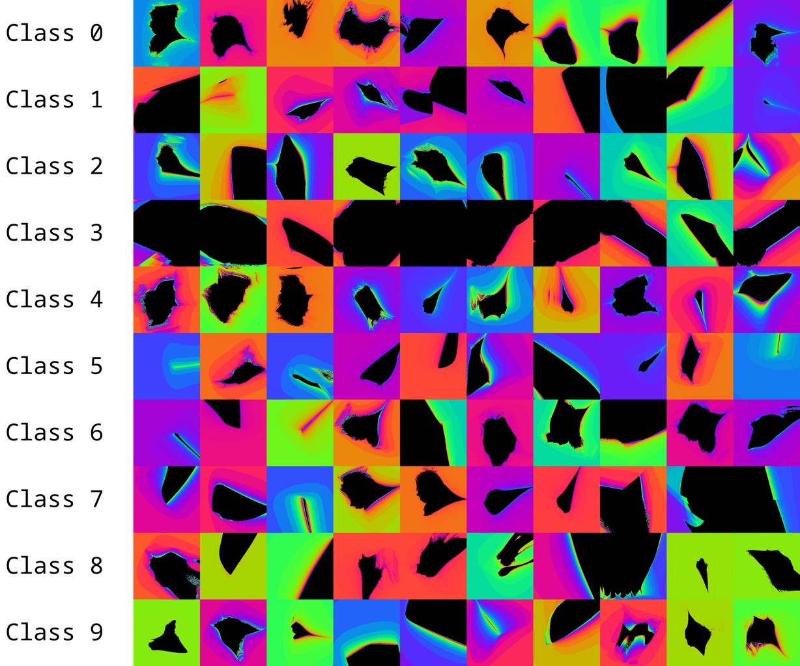
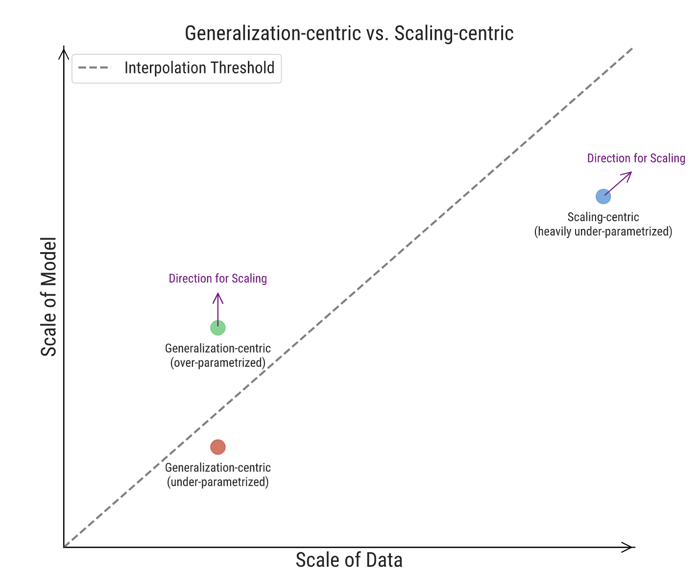

# Infinite-Fractal-Stream: Small Scale Proxy for Scaling-Centric ML


<p align="center">
  
</p>


Test your method not on CIFAR, not on MNIST, but on infinite fractal streams. This piece of code generates infinite stream of fractal images that are parameterized by 4 coefficients. You can use them to train classification models, diffusion models, VAE, etc. It is written in triton code, so each fractal generation is blazing fast. 

# Cool but whats wrong with CIFAR?

There is nothing wrong with CIFAR, it is just that sometimes, CIFARs have too little data. In the era of infinite data, we should be testing our method on small scale dataset, but infinite one!

<p align="center">
  
</p>

| Figure from [Rethinking Conventional Wisdom in Machine Learning: From Generalization to Scaling](https://arxiv.org/abs/2409.15156). It is clear that modern machine learning shifted from finite-data, over-parameterized regime (multiple-epoch training) to infinite-data, under-parameterized regime (sub-one-epoch training).

Problem with using CIFAR or MNIST for testing is that they are good proxy for dealing with overfitting and over-parameterization problem, which is not the case for modern scaling-centric paradigms. All of the language model trainings for example, are mostly all done in single epoch, at worst case, never oversampling 10 epoch per data sources.

We need to have toy problems that are highly non-trivial, and yet light-weight, but diverse, precise, generalizable yet infinite. Parameterized fractals might be the answer.

# How to use

API is intended to be used as parameterizing class with 4 coefficients.

$$
\text{poly0}, \text{poly1}, \text{poly2}, \text{poly3} \sim U(-1, 1) \\
$$

Given 4 coefficients, we generate infinite number of images. At any point, $\alpha$, $\beta$, $p$ are sampled from uniform distribution, making it latent variable. Generation is in favor of mandelbrot set, with $R$ and $max_iter$ as parameters.

$$
\begin{align*}
z_0 &= 0, \alpha \sim U(0, 2\pi), \beta \sim U(0, 2\pi), p \sim U(0, 5) \\
z_{n+1} &= \left( f(z_n) \cdot e^{i \alpha} \right)^p + c \cdot e^{i \beta} \\
f(z_n) &= P\left( \Re(z_n) \right) + i \Im(z_n) \\
P(x) &= \text{poly0} + \text{poly1} \cdot x^2 + \text{poly2} \cdot x^3 + \text{poly3} \cdot x^4 \\[10pt]
\end{align*}
$$

$$
\text{and the iteration continues max of iterations or until} \quad |z_n|^2 \geq R^2.
$$

```python

from fractal_dataset import FractalImageDataset

dataset = FractalImageDataset(
    num_classes=10,
    num_samples_per_class=10,
    image_size=512,
    max_iter=30,
    R=4.0,
    device="cuda",
    train=True,
    seed=0,
)

# you can access images and labels by index
image, label = dataset[0]

# you can use get_batch method to get batch of images and labels.
# I recommend this over dataloader.
images, labels = dataset.get_batch(batch_size=32)

# to get next batch call this method again
images, labels = dataset.get_batch(batch_size=32)

# to reset dataset call reset method
dataset.reset()

```

# Example of training

```bash
bash vit_runner.sh
```

# Visualization

Have a look at `visualization.ipynb` to see how to visualize dataset.

# Citation

If you find this dataset useful, please cite:

```bibtex
@misc{infinite-fractal-stream,
  author = {Simo Ryu},
  title = {Infinite-Fractal-Stream},
  year = {2024},
  publisher = {GitHub},
  journal = {GitHub repository},
  howpublished = {\url{https://github.com/cloneofsimo/infinite-fractal-stream}},
}
```